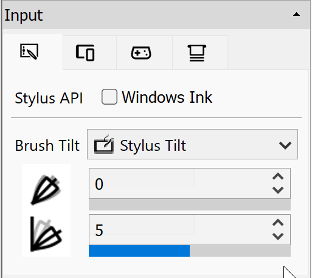
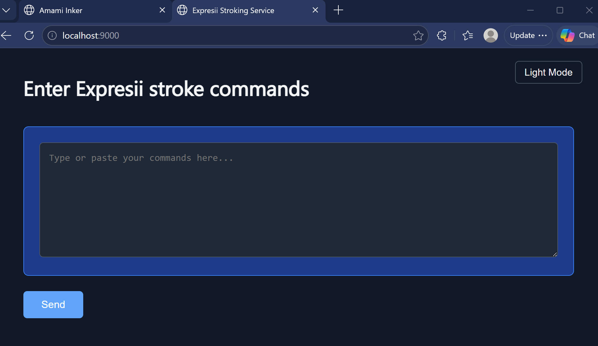

#   Amami Inker

Amami Inker is a web app that converts SVG curves to Expresii Paint strokes. It can export to an .XST (Expresii Stroke) file, or send the generated stroke commands directly to Expresii Paint app.

## How to run Amami Inker
Download Amami.html and open it with a web browser. You first load an SVG file. You can then adjust settings and then press 'Generate Stroke Commands' to generate the stroke commands. Note that the stroke preview is not exact.

## How to run stroke commands
You can drag the generated .XST file onto Expresii to load the stroke commands. A stroke recorder window would appear. Or, you can press the 'Send' button from the web app after you generate the stroke commands. You need to enable web API service from Expresii Paint app. This uses port 9000.

Once server is started, you can check if it's up by going to localhost:9000 in a browser:

In the Amami Inker page, you can press 'Send' to send the generated commands to Expresii (server feature available since version 2026.04.30) directly: 

The sample horse SVG is from Clipasso (https://clipasso.github.io/clipasso).

## Connecting with AI agent
Teaching a computer to draw objects as simple abstract strokes is not easy. Ever since the Clipasso work came out in 2022, we would like to combine this with Expresii. Down the road, we hope to see AI agents draw/paint things via this interface. A [stroke file format description](./ExpresiiStrokeFileFormatDescription.txt) is put online. You can start creating skill files from the description for AI agents.